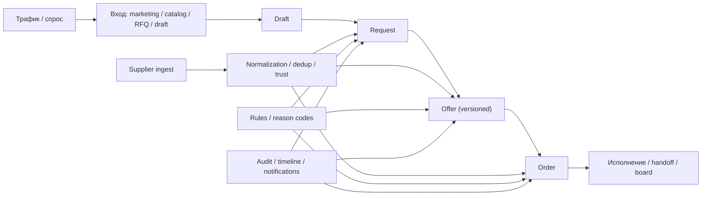
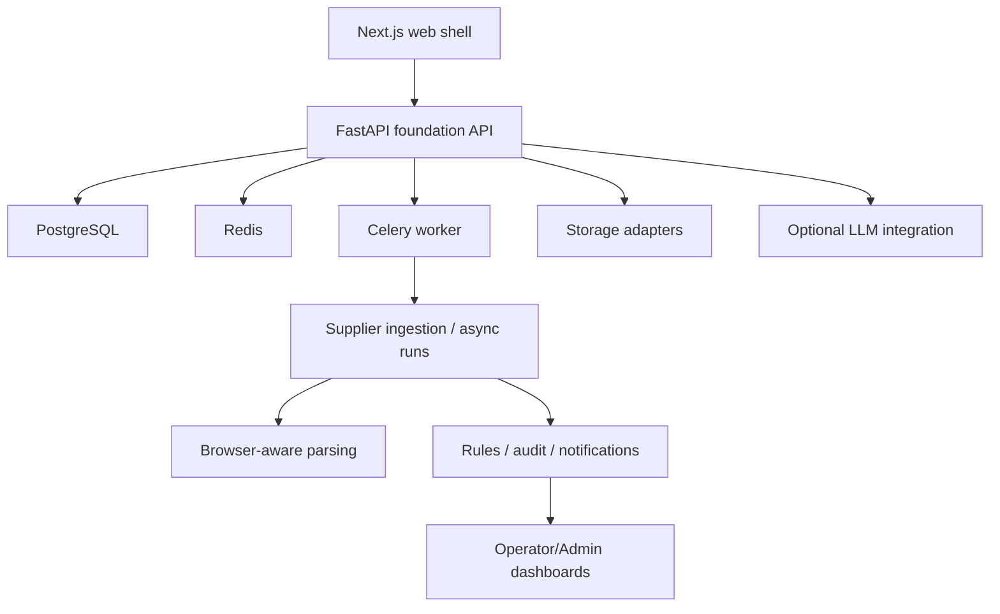
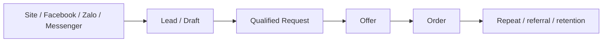

# Полный аудит проекта MagonOS Standalone

Дата среза: `2026-04-23`
Репозиторий: `/Users/anton/Desktop/MagonOS-Standalone`

## Назначение

Этот документ собирает один целостный срез проекта:

- что уже реально построено;
- что является целевым продуктом;
- где проходит граница между готовым контуром и ещё не закрытыми зонами;
- как это выглядит с точки зрения бизнеса, архитектуры, кода, управления, маркетинга и продаж.

Документ опирается на код, тесты и runtime-документацию, а не на абстрактные ожидания.

## Источники и evidence

Основные источники:

- `docs/current-project-state.md`
- `docs/ru/current-project-state.md`
- `docs/ru/foundation-architecture-as-built.md`
- `docs/business-logic-parity-audit.md`
- `docs/visuals/project-map.md`
- `README.md`
- `docs/implementation-log-wave1-foundation.md`
- `gpt_doc/codex_wave1_spec_ru.docx`
- `gpt_doc/platform_documentation_pack_ru_with_marketing.docx`
- `gpt_doc/project_marketing_research_vietnam_ru.docx`
- `src/magon_standalone/foundation/app.py`
- `src/magon_standalone/foundation/models.py`
- `src/magon_standalone/foundation/modules/*`
- `src/magon_standalone/supplier_intelligence/*`
- `apps/web/app/*`
- `tests/test_foundation_*.py`

## Executive summary

### Короткий вывод

`MagonOS Standalone` сейчас уже является **рабочим foundation-контуром коммерческой платформы для print / packaging sourcing и service intake**, а не просто прототипом интерфейса или парсером поставщиков.

Но это ещё **не завершённая ERP/CRM-система** и не полноценный маркетплейс.

Текущее честное позиционирование проекта:

- снаружи: управляемый сервисный вход в печать и упаковку;
- внутри: modular monolith для цепочки `draft -> request -> offer -> order`;
- сбоку: supplier intelligence как источник исполнимости и supply-side контроля;
- в основе операционки: manual-first модель с explainable automation;
- по внутреннему core ERP-направлению: Odoo рассматривается как будущий/внутренний контур, а не как то, что надо заново изобретать в standalone.

### Что уже можно считать готовым контуром

- supplier ingest / normalization / dedup / scoring;
- публичный вход через marketing, catalog, RFQ и guest draft;
- рабочий request intake;
- versioned offers;
- order conversion после accepted offer;
- managed files/documents;
- role-based operator/admin/customer surfaces;
- explainable audit/reason/rules layer;
- локальный production-like runtime на `FastAPI + PostgreSQL + Redis + Celery + Next + Caddy`.

### Что пока нельзя честно называть готовым

- полный CRM;
- полная quote/RFQ семантика уровня зрелого коммерческого ядра;
- customer/account ownership без overlap;
- полноценный supplier portal;
- платежи, бухгалтерия, ERP order management;
- масштабируемая sales-операционка с подтверждённой коммерческой воронкой.

## Что мы здесь строим на самом деле

### Продуктовая формула

Проект строится не как "сайт типографии" и не как "универсальный B2B-маркетплейс".

Его фактическая продуктовая формула такая:

| Слой | Что это |
| --- | --- |
| Внешний | Витрина, RFQ, draft intake, понятный вход в заказ |
| Коммерческое ядро | `Draft -> Request -> Offer -> Order` |
| Supply-side | Поставщики, сайты, ingest, trust, capability, explainability |
| Операционка | Review, rules, audit, dashboards, notifications |
| Внутренний ERP-вектор | Не строится с нуля; при необходимости ядро должно стыковаться с Odoo |

### Главная бизнес-идея

Ключевая ценность проекта не в "AI" и не в "маркетплейсе".

Ключевая ценность:

**снять хаос между клиентским запросом и фрагментированным рынком поставщиков, доведя заявку до предложения и заказа в управляемом, объяснимом и контролируемом процессе.**

### Главный рыночный тезис первой волны

По внутренним маркетинговым документам первая волна должна продавать не "платформу", а **managed service на базе платформы**:

`Печать и упаковка без хаоса: одна заявка, нормальный бриф, быстрое предложение, контроль файлов, сроков и исполнителя.`

Это соответствует текущему уровню готовности лучше, чем формулировки про:

- полный marketplace;
- полную автоматизацию;
- AI-first продукт.

## Визуальная карта продукта

## Текущая готовность по направлениям

| Направление | Статус | Что видно по коду и докам | Вердикт |
| --- | --- | --- | --- |
| Supplier intelligence | Высокая | Отдельный пакет, ingestion, browser-aware routing, retry/failure states, тесты, UI | Реально рабочий контур |
| Public marketing shell | Средняя+ | Есть `/`, `/marketing`, `/catalog`, `/rfq`, product-first copy, Next shell | Готов для demand testing |
| Draft/Request intake | Высокая | Отдельные сущности, submit flow, required-field gating, acceptance tests | Рабочий foundation core |
| Offers | Высокая | Versioned offers, send/accept/convert-to-order, audit trail | Реально реализовано |
| Orders | Средняя+ | Order workbench и detail, thin orchestration, не полный ERP | Рабочий тонкий слой |
| Files/Documents | Средняя+ | Managed assets, versions, role visibility, archive checks | Достаточно для wave1 |
| Rules/Audit/Dashboards | Средняя+ | Reason codes, rules, notification rules, dashboards, audit events | Рабочий operational minimum |
| Auth/Roles | Средняя+ | `guest/customer/operator/admin`, sessions, protected routes, tests | Достаточно для foundation |
| Marketing / GTM | Средняя- | Позиционирование и каналы описаны, но market loop не доказан реальными продажами | Стратегия есть, engine продаж ещё нет |
| CRM / commercial semantics | Низкая-средняя | Опасный overlap по customer/lead/RFQ/quote boundary | Главный незакрытый риск |
| ERP / finance / payments | Низкая | Намеренно вне scope | Не строить сейчас |
| Repo operations / automations | Высокая | restore/finalize/verify/launchd/guards/skills | Сильный операционный слой |

## Аудит бизнес-логики

### Что уже подтверждено как бизнес-ядро

| Домен | Что реально есть | Комментарий |
| --- | --- | --- |
| Draft | Черновик с обязательными полями, autosave/submit boundary | Это не форма-обманка, а реальная сущность |
| Request | Review, clarification, supplier search, offer prep statuses | Есть процесс, а не просто карточка |
| Offer | Версии, send, accept/decline/expire, compare | Коммерческий слой уже живой |
| Order | Отдельная сущность после accepted offer | Правильная граница подтверждена |
| Supplier | Raw -> normalized -> confirmed/trusted layering | Supply-side строится системно |
| Audit | Reason codes, audit events, explainability | Это важно для управляемости |
| Documents/files | Версии, проверки, архив, visibility | Реально полезно для операционки |

### Что уже хорошо решено

1. Процесс не схлопнут в одну универсальную сущность.
2. Критичные переходы держатся через `reason_code`, audit trail и role restrictions.
3. Supplier-side не прибит гвоздями к ручной таблице: у него есть pipeline, ingest registry, retry, state.
4. Проект не пытается строить full ERP prematurely.
5. Automation используется как explainable assist, а не как скрытый black box.

### Где главный незакрытый semantic risk

Самый опасный бизнес-overlap сейчас не в supplier intelligence, а в коммерческой части:

| Зона | Проблема |
| --- | --- |
| Customer identity | Не до конца зафиксировано, где источник истины по account/customer ownership |
| Lead/Opportunity | Нет до конца жёсткой границы ownership и семантики |
| RFQ / Quote boundary | Есть работающий contour, но нельзя честно заявлять полный parity зрелого quote-domain |
| CRM history | Нет признаков полноценного ownership всех sales interactions как законченного CRM |

### Управленческий вывод по бизнес-логике

Сейчас проект уже годится для **manual-first lead intake и controlled order preparation**, но ещё не годится для честного заявления:

- "у нас уже полноценный CRM";
- "у нас уже полноценный quote engine";
- "мы уже закрыли коммерческое ядро без остатка".

Правильная формулировка:

**Коммерческий foundation построен, но ownership customer/lead/RFQ semantics ещё требует жёсткого продуктового и модельного закрепления.**

## Аудит архитектуры

### Фактический архитектурный стиль

Судя по коду и `docs/ru/foundation-architecture-as-built.md`, проект идёт по правильной для текущей стадии модели:

- `modular monolith`, а не микросервисы;
- отдельный public/customer слой и internal operator/admin слой;
- отдельный supplier intelligence contour;
- отдельный integrations boundary;
- explainability-first operational layer.

### Архитектурная схема

### Что хорошо

| Решение | Почему это правильно |
| --- | --- |
| Modular monolith | Для текущей стадии даёт скорость, контроль и меньше лишней сложности |
| Separate entities `Draft/Request/Offer/Order` | Защищает бизнес-семантику от хаоса |
| Explicit module routers | Нет скрытой магии подключения модулей |
| System modes `normal/test/maintenance/emergency` | Есть operational control, а не только happy path |
| Rules + audit + reason codes | Это foundation для explainable ops |
| Separate integrations layer | Есть место для storage/LLM/notifications/source adapters без зашивания в ядро |

### Что архитектурно ещё тонкое

| Тема | Наблюдение |
| --- | --- |
| Shared ownership между коммерческим ядром и будущим ERP-контуром | Нужна ещё более жёсткая boundary policy |
| Route naming на web | Есть часть secondary/legacy-ish маршрутов вроде `/ops-workbench`, хотя канонические пути уже другие |
| Repo operations vs product core | Операционный слой репозитория сильный, но его важно не перепутать с продуктовой зрелостью |

### Архитектурный вердикт

Архитектура выбрана здраво.

Проблема проекта сейчас не в том, что "не та архитектура".
Проблема в том, что **бизнесовая семантика центрального коммерческого ownership ещё не дожата до той же чёткости, до которой уже дожаты supplier и operational contours.**

## Аудит кода и реализации

### Инвентаризация по коду

По текущему дереву проекта:

- backend foundation modules: `13` router-модулей + `shared`;
- frontend app routes: `25` страниц + `1` root layout;
- test files в `tests/`: `33`;
- отдельный пакет `supplier_intelligence`;
- отдельный foundation backend;
- отдельный repo-operations слой.

### Backend-модули foundation

| Модуль | Назначение |
| --- | --- |
| `users_access` | роли, пользователи, сессии |
| `companies` | компании, контакты, адреса |
| `suppliers` | source registry, ingests, supplier entities |
| `catalog` | public catalog / showcase |
| `drafts_requests` | draft/request flow |
| `offers` | offer lifecycle |
| `orders` | order orchestration |
| `files_media` | файловый контур |
| `documents` | документный контур |
| `llm` | operator-facing LLM status/test contour |
| `comms` | messaging/notifications/events |
| `rules_engine` | reason/rule metadata and checks |
| `audit_dashboards` | dashboards, audit views, summaries |

### Что видно по model layer

`src/magon_standalone/foundation/models.py` подтверждает, что проект хранит не только "витринные" сущности, а реальный foundation schema:

- users / roles / sessions;
- companies / contacts / addresses;
- suppliers / source registries / raw ingests / normalization / dedup;
- коммерческие и операционные сущности;
- архивный контур;
- JSON payloads там, где нужна explainability и evidence.

### Что видно по acceptance/tests

Тесты подтверждают не только health endpoint'ы, но и реальные бизнес-сценарии:

- login и role restrictions;
- draft -> request -> offer -> order;
- maintenance mode write blocking;
- supplier ingest failure/retry visibility;
- archive behavior для files/documents;
- foundation module coverage по основным доменам.

### Кодовый вердикт

Кодовая база уже вышла из стадии "скелет без процесса".

Сейчас это **рабочая foundation codebase с сильной продуктовой структурой**, но с очевидным фокусом на:

- first-wave contour;
- controlled scope;
- pragmatic operations;
- manual-first execution.

## Аудит управленческой и операционной зрелости

### Что уже хорошо как у зрелой команды

| Направление | Факт |
| --- | --- |
| Repo discipline | `restore_context`, `verify_workflow`, `finalize_task`, project memory |
| Guardrails | Git hooks, RU-doc contract, comment contract, verification path |
| Operational truth | Есть canonical current-state docs, а не только README |
| Local automation | launchd watchdog, periodic checks, repo automation status |
| Runtime truthfulness | Документация явно режет legacy drift и ложные runtime-пути |

### Что это значит менеджерски

Это сильный сигнал:

- проект ведётся не хаотично;
- накопление знаний не только "в голове";
- есть попытка не терять контекст между сессиями;
- технический долг по truth-source управляется осознанно.

### Что ещё менеджерски не закрыто

| Зона | Риск |
| --- | --- |
| Product ownership map | Нужно жёстче зафиксировать, кто владеет customer/lead/RFQ semantics |
| KPI loop | Есть хорошие идеи по метрикам, но не видно замкнутого цикла управления по фактическим продажам |
| GTM execution engine | Каналы и тезисы есть, но нет признаков уже работающей дисциплины регулярного acquisition |
| Commercial process governance | Нужно превратить overlap-зону в explicit ownership policy |

### Управленческий диагноз

Проект технически управляется лучше, чем коммерчески формализован.

То есть:

- техническая дисциплина уже выше средней;
- продуктовая картина достаточно ясна;
- коммерческая ownership-модель пока ещё уступает уровню зрелости runtime и кода.

## Аудит маркетинга и продаж

### Что говорит внутренняя стратегия

Маркетинговые документы внутри репозитория довольно согласованы:

- стартовый рынок: Вьетнам;
- первая ценность: managed print/packaging service;
- приоритетные сегменты: SME, e-commerce, F&B, cosmetics, FMCG, exporters, agencies;
- каналы первой волны: сайт + форма, Facebook, Messenger, Zalo;
- второй слой: TikTok, LinkedIn;
- запрет на распыление в Instagram-first / WhatsApp-first / AI-first narrative.

### GTM-схема первой волны

### Что в маркетинговой части сильное

| Сильная сторона | Почему это хорошо |
| --- | --- |
| Позиционирование через managed service | Совпадает с реальной зрелостью продукта |
| Supplier-first foundation | Даёт правдоподобную исполнимость, а не пустую витрину |
| Фокус на понятных товарных категориях | Упрощает demand testing |
| Каналы под Вьетнам выбраны прагматично | Facebook/Zalo логичнее, чем абстрактный "global social" набор |

### Где маркетинг пока слабее продукта

| Слабое место | Комментарий |
| --- | --- |
| Нет evidence реальных рыночных conversion loops внутри репозитория | Стратегия описана, операционная воронка ещё не доказана |
| Нет признаков зрелой CRM-аналитики по лидам | Это связано с незакрытым customer/lead ownership |
| Нет признаков зафиксированного sales playbook по сегментам | Маркетинг описан лучше, чем повседневная коммерческая система исполнения |

### Продажный вердикт

На текущей стадии проект лучше всего продавать как:

**операторски управляемый сервис с сильным intake + supplier-routing ядром.**

Не стоит продавать его как:

- finished marketplace;
- full procurement platform;
- AI procurement engine;
- replacement ERP.

## Целеполагание: к чему мы идём

### Реальный ближний вектор проекта

Если убрать лишние формулировки, текущий ближайший вектор проекта такой:

1. Стабильно принимать и квалифицировать спрос.
2. Давать понятный путь от заявки к предложению.
3. Увязывать коммерческий контур с реальным supply-side.
4. Поддерживать order handoff без ERP-переусложнения.
5. Доказать спрос и операционную пригодность на ограниченном рынке и наборе категорий.

### Неявный, но фактический north star

**Построить коммерчески пригодный внешний слой для print/packaging service intake и controlled sourcing, который позже может стыковаться с внутренним ERP-ядром, не превращаясь сейчас в ERP-монстра.**

### Что не должно стать целью по ошибке

- строить всё для всех;
- дублировать ERP;
- уходить в generic CRM;
- тратить волну на AI-витрины без доказанного workflow gain;
- делать маркетинг шире, чем текущий процесс умеет реально переварить.

## Главные риски проекта

| Риск | Уровень | Почему |
| --- | --- | --- |
| Overlap customer / lead / RFQ / quote semantics | Высокий | Это центральная коммерческая зона, а ownership ещё не закрыт до конца |
| Расхождение между сильной техдисциплиной и недооформленной sales-операционкой | Средний-высокий | Можно хорошо строить систему, но медленно доказывать revenue-loop |
| Иллюзия большей готовности, чем есть на самом деле | Средний | Проект уже выглядит убедительно, из-за чего легко переоценить CRM/ERP зрелость |
| Drift по secondary routes и naming | Средний | Каноническая правда уже жёсткая, но в web ещё есть часть secondary surfaces |
| Смешение product runtime и repo operations success | Средний | Зелёный automation-layer не равен доказанной рыночной traction |

## Приоритеты руководителя проекта на ближайший цикл

### Что имеет смысл считать главным

| Приоритет | Почему он первый |
| --- | --- |
| Зафиксировать ownership customer/lead/RFQ/quote boundary | Это главный незакрытый бизнес-риск |
| Довести intake -> offer -> order как измеряемый путь | Это основа revenue proof |
| Запускать demand testing на ограниченных товарных направлениях | Это соответствует текущей зрелости продукта |
| Не расползаться в ERP/finance scope | Сейчас это убьёт фокус |
| Подтвердить GTM loop на нескольких каналах, а не везде | Нужно качество сигнала, а не ширина присутствия |

### Что намеренно не надо делать сейчас

- полный supplier portal;
- полный payment core;
- склад/MES;
- большой CRM;
- микросервисный раскол;
- broad international expansion narrative без подтверждённого local loop.

## Финальный вердикт

### Что проект уже представляет собой

`MagonOS Standalone` на текущую дату это:

- не игрушка;
- не просто research repo;
- не просто supplier parser;
- не законченный ERP/CRM;
- а **сильный foundation-продукт для controlled commercial intake и supplier-backed execution в print/packaging domain**.

### В чём главная сила

Главная сила проекта сейчас:

**редкое сочетание вменяемой архитектуры, сильной технической дисциплины, уже реализованного process-core и честно ограниченного scope.**

### В чём главная слабость

Главная слабость проекта сейчас:

**центральная коммерческая ownership-семантика ещё отстаёт по степени фиксации от того, насколько уже хорошо собраны supplier и runtime contours.**

### Честная итоговая оценка

| Срез | Оценка |
| --- | --- |
| Техническая зрелость foundation | Высокая для wave1 |
| Архитектурная адекватность | Высокая |
| Product clarity | Средняя-высокая |
| Бизнесовая сфокусированность | Высокая |
| Коммерческая semantic closure | Средняя |
| Маркетинговая стратегия | Средняя+ |
| Реальная sales-operating maturity | Средняя- |
| Риск расползания scope | Высокий, если потерять discipline |

## Итог одной фразой

Проект уже готов не к "широкой платформенной мечте", а к **доказуемому запуску узкого, управляемого, коммерчески осмысленного контура print/packaging intake + supplier-backed fulfillment**, и следующий главный шаг здесь не переписывание архитектуры, а дожим центральной коммерческой ownership-модели и demand-validation цикла.
