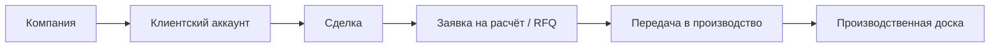

# Визуальная карта проекта

Обновлено: ``2026-04-17 20:27 +07``

## Контур движения

## Что уже принадлежит standalone

- контур реестра компаний / поставщиков / площадок со слоями `raw -> normalized -> confirmed`
- конвейер проверки и обогащения поставщиков
- нормализация / обогащение / дедупликация / скоринг
- ограниченный контур каталога / витрины с гостевым входом в draft и RFQ
- autosave / abandoned / archive-ready слой Draft
- центральная операторская очередь Review для Request с blocker/clarification flow
- переход `draft -> request` с блокировкой по обязательным полям
- versioned-коммерческий слой Offer с compare, reset confirmation и отдельной конвертацией в Order
- слой `Order` с `OrderLine`, внутренним payment skeleton, ledger trail и operator workbench
- управляемый файловый и документный контур со storage abstraction, versioning, checks, templates и role-based download flow
- foundation-скелет FastAPI с отдельными сущностями `draft / request / offer / order`
- маршрутизация / квалификационные решения
- журнал обратной связи / проекция
- оценка трудозатрат

## Что сейчас является ядром контура

- компания
- граница черновика запроса / intake-заявки
- коммерческий контекст клиента
- сделка
- заявка на расчёт / граница RFQ
- передача в производство
- производственная доска

## Где остаётся риск overlap

- идентичность клиента / аккаунта
- владение сделкой / лидом
- граница RFQ / расчёта

## Что не должно расползаться в scope

- бухгалтерия
- счета / оплаты
- полное ERP-управление заказами
- огромная универсальная CRM
- широкое зеркалирование сущностей Odoo
- рост функциональности donor-репозитория

## Активный контекст

- Текущий фокус: Keep the standalone wave1 contour demo-ready and evolution-safe without widening into post-wave-1 modules.
- Последний подтверждённый статус workflow: PASS `./scripts/verify_workflow.sh`, PASS `bash ./scripts/foundation_migration_check.sh`, PASS `bash ./scripts/foundation_supplier_smoke_check.sh`, PASS `bash ./scripts/foundation_request_smoke_check.sh`, PASS `bash ./scripts/foundation_offer_smoke_check.sh`, PASS `bash ./scripts/foundation_order_smoke_check.sh`, PASS `bash ./scripts/foundation_files_documents_smoke_check.sh`, PASS `bash ./scripts/foundation_messages_dashboards_smoke_check.sh`, PASS `bash ./scripts/foundation_wave1_demo_smoke_check.sh`, PASS `cd apps/web && npm run lint && npm run typecheck && npm run build`
- Главный операционный риск: Wave1 still intentionally stops short of a full archive UI, full escalation orchestration, and broader payment/supplier portal scope; the main remaining build warning comes from third-party Sentry/Prisma/OpenTelemetry integration code rather than product code.

## Автоматические контуры контроля

- Hourly Repo Guard
- Hourly Platform Smoke
- RU Locale Guard
- Hourly Visual Map
- Weekly Release Gate
- Launchd Periodic Checks

## Активные project skills

- audit-docs-vs-runtime
- automation-context-guard
- ci-watch-fix
- docs-sync-curator
- donor-boundary-audit
- git-safe-commit
- operate-platform
- operate-standalone-intelligence
- project-visual-map
- release-readiness-gate
- skill-pattern-scan
- skill-project-bootstrap
- verify-implementation
- web-regression-pass
