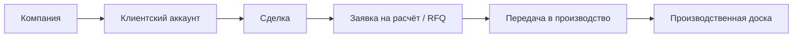

# Визуальная карта проекта

Обновлено: ``2026-04-17 07:59 +07``

## Контур движения

## Что уже принадлежит standalone

- конвейер проверки и обогащения поставщиков
- нормализация / обогащение / дедупликация / скоринг
- очередь проверки
- маршрутизация / квалификационные решения
- журнал обратной связи / проекция
- оценка трудозатрат

## Что сейчас является ядром контура

- компания
- коммерческий контекст клиента
- сделка
- заявка на расчёт / граница RFQ
- передача в производство
- производственная доска

## Где остаётся риск overlap

- идентичность клиента / аккаунта
- владение сделкой / лидом
- граница RFQ / расчёта

## Что не должно расползаться в scope

- бухгалтерия
- счета / оплаты
- полное ERP-управление заказами
- огромная универсальная CRM
- широкое зеркалирование сущностей Odoo
- рост функциональности donor-репозитория

## Активный контекст

- Текущий фокус: Keep the Russian shell visually clear and semantically readable while architecture work continues.
- Последний подтверждённый статус workflow: PASS `cd apps/web && npm run typecheck`, PASS `./scripts/verify_workflow.sh --with-web`
- Главный операционный риск: Russian shell wording still depends on upstream project-memory summaries, so uncommon new English phrases may still need explicit localization mapping.

## Автоматические контуры контроля

- Hourly Repo Guard
- Hourly Platform Smoke
- RU Locale Guard
- Hourly Visual Map
- Weekly Release Gate
- Launchd Periodic Checks

## Активные project skills

- audit-docs-vs-runtime
- ci-watch-fix
- docs-sync-curator
- donor-boundary-audit
- git-safe-commit
- operate-platform
- operate-standalone-intelligence
- project-visual-map
- release-readiness-gate
- skill-pattern-scan
- verify-implementation
- web-regression-pass
