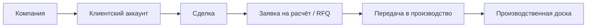

# Визуальная карта проекта

Обновлено: ``2026-04-23 01:32 +07``

## Контур движения

## Что уже принадлежит standalone

- контур реестра компаний / поставщиков / площадок со слоями `raw -> normalized -> confirmed`
- конвейер проверки и обогащения поставщиков
- реестр источников поставщиков с двумя режимами первой волны: повторяемый fixture-ingest для demo/тестов и выбираемый live parsing ingest поверх существующего supplier-intelligence discovery
- операторский контроль источников поставщиков: health адаптера, последний успех/сбой, queued parsing jobs, retry и повторный запуск прямо из UI standalone-контура
- env-gated LLM-подключение для `ai_assisted` fallback внутри supplier parsing с явным operator status/test path вместо скрытой чёрной магии
- repo-aware периодический scheduler для live parsing/classification: fixture-источник остаётся manual-only, а `scenario_live` может работать постоянно через launchd cadence
- header и operator shell очищены до компактной рабочей навигации; вторичные разделы вынесены в панель `Ещё`, а supplier-экран локализован и визуально уплотнён под реальную операторскую работу
- нормализация / обогащение / дедупликация / скоринг
- лёгкий marketing/conversion-layer поверх витрины, RFQ и гостевого draft-входа
- ограниченный контур каталога / витрины с гостевым входом в draft и RFQ
- autosave / abandoned / archive-ready слой Draft
- центральная операторская очередь Review для Request с blocker/clarification flow
- переход `draft -> request` с блокировкой по обязательным полям
- versioned-коммерческий слой Offer с compare, reset confirmation и отдельной конвертацией в Order
- слой `Order` с `OrderLine`, внутренним payment skeleton, ledger trail и operator workbench
- управляемый файловый и документный контур со storage abstraction, versioning, checks, templates и role-based download flow
- контур админ-настройки для reason codes, rules, rule versions, notification rules и supplier source settings через API/UI, а не только через сиды
- foundation-скелет FastAPI с отдельными сущностями `draft / request / offer / order`
- маршрутизация / квалификационные решения
- журнал обратной связи / проекция
- оценка трудозатрат

## Что сейчас является ядром контура

- компания
- граница черновика запроса / intake-заявки
- коммерческий контекст клиента
- сделка
- заявка на расчёт / граница RFQ
- передача в производство
- производственная доска

## Где остаётся риск overlap

- идентичность клиента / аккаунта
- владение сделкой / лидом
- граница RFQ / расчёта

## Что не должно расползаться в scope

- бухгалтерия
- счета / оплаты
- полное ERP-управление заказами
- огромная универсальная CRM
- широкое зеркалирование legacy-сущностей
- рост функциональности source-репозитория

## Активный контекст

- Текущий фокус: Keep the standalone repo on one active foundation runtime, one admin-configurable business contour, and no legacy shell drift in product-facing surfaces.
- Последний подтверждённый статус workflow: PASS `cd apps/web && npm run typecheck`, PASS `./scripts/verify_workflow.sh --with-web`
- Главный операционный риск: Historical source-only modules and audits still exist in the repo for evidence, but the active foundation runtime no longer depends on them; the remaining operational caveat is macOS launchd state outside the product contour.

## Автоматические контуры контроля

- Hourly Repo Guard
- Hourly Platform Smoke
- RU Locale Guard
- Hourly Visual Map
- Weekly Release Gate
- Launchd Periodic Checks

## Активные project skills

- audit-docs-vs-runtime
- automation-context-guard
- ci-watch-fix
- docs-sync-curator
- donor-boundary-audit
- git-safe-commit
- operate-platform
- operate-standalone-intelligence
- project-visual-map
- release-readiness-gate
- skill-pattern-scan
- verify-implementation
- web-regression-pass
