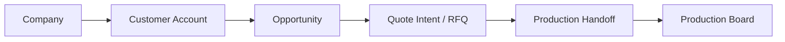

# Визуальная карта проекта

Обновлено: ``2026-04-17 05:58 +07``

## Контур движения

## Что уже принадлежит standalone

- supplier intelligence pipeline
- normalization / enrichment / dedup / scoring
- review queue
- routing / qualification decisions
- feedback ledger / projection
- workforce estimation

## Что сейчас является ядром контура

- company
- commercial/customer context
- opportunity
- quote intent / RFQ boundary
- production handoff
- production board

## Где остаётся риск overlap

- customer/account identity
- opportunity/lead ownership
- RFQ / quote boundary

## Что не должно расползаться в scope

- accounting
- invoice / payment
- full ERP order management
- giant generic CRM
- broad Odoo entity mirroring
- source repo feature growth

## Активный контекст

- Current focus: Stable autosync, staggered automation cadence, and a verified path to promote develop to main
- Last verified workflow status: PASS `./.venv/bin/python -m unittest tests.test_periodic_checks tests.test_launchd_periodic_checks tests.test_observability tests.test_repo_autosync`, PASS `./scripts/verify_workflow.sh --with-web`, PASS `./.venv/bin/python scripts/run_periodic_checks.py --mode manual`
- Biggest operational risk: Local dev-shell latency under k6 load is still the main unresolved production-scale risk; the new cadence only removes automation overlap and drift noise.

## Автоматические контуры контроля

- Hourly Repo Guard
- Hourly Platform Smoke
- Hourly Visual Map
- Weekly Release Gate
- Launchd Periodic Checks

## Активные project skills

- audit-docs-vs-runtime
- ci-watch-fix
- docs-sync-curator
- donor-boundary-audit
- git-safe-commit
- operate-platform
- operate-standalone-intelligence
- project-visual-map
- release-readiness-gate
- skill-pattern-scan
- verify-implementation
- web-regression-pass
