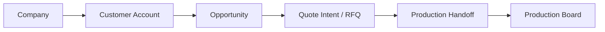

# Project Visual Map

Updated: `2026-04-17 05:39 +0700`

## Flow contour

## Standalone-owned capabilities

- supplier intelligence pipeline
- normalization / enrichment / dedup / scoring
- review queue
- routing / qualification decisions
- feedback ledger / projection
- workforce estimation

## Validated contour

- company
- commercial/customer context
- opportunity
- quote intent / RFQ boundary
- production handoff
- production board

## Dangerous overlap

- customer/account identity
- opportunity/lead ownership
- RFQ / quote boundary

## Out of scope

- accounting
- invoice / payment
- full ERP order management
- giant generic CRM
- broad Odoo entity mirroring
- source repo feature growth
