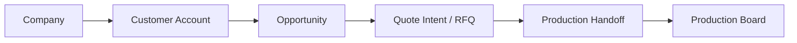

# Project Visual Map

Updated: ``2026-04-17 20:27 +07``

## Flow contour

## Standalone-owned capabilities

- company/supplier/site registry contour with raw -> normalized -> confirmed layering
- supplier intelligence pipeline
- normalization / enrichment / dedup / scoring
- limited catalog / showcase contour with guest draft + RFQ entry
- draft autosave / abandoned / archive-ready intake layer
- central request review queue with blocker/clarification flow
- request draft -> request submit flow with required-field gating
- versioned offer layer with compare, confirmation reset, accept/decline/expire, and separate order conversion
- order layer with `OrderLine`, internal payment skeleton, ledger trail, and operator workbench
- managed files/documents contour with storage abstraction, versioning, checks, templates, and role-based download flow
- foundation FastAPI skeleton with separate draft/request/offer/order entities
- routing / qualification decisions
- feedback ledger / projection
- workforce estimation

## Validated contour

- company
- request draft / intake boundary
- commercial/customer context
- opportunity
- quote intent / RFQ boundary
- production handoff
- production board

## Dangerous overlap

- customer/account identity
- opportunity/lead ownership
- RFQ / quote boundary

## Out of scope

- accounting
- invoice / payment
- full ERP order management
- giant generic CRM
- broad Odoo entity mirroring
- source repo feature growth
